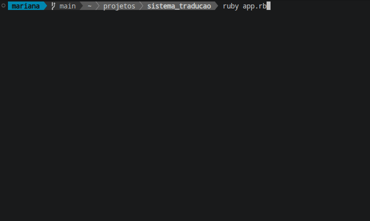

# 🌐 Translation System

A Ruby project developed to create a system capable of translating sentences between different languages using a translation API.

This project brings together several concepts learned during my Ruby studies, including Object-Oriented Programming, web requests, JSON, file handling, user input, and date and time formatting.

## 📌 Features

- Asks the user for a sentence to translate;
- Allows the user to choose the source and target languages;
- Performs translations through an HTTP request;
- Handles API responses in JSON format;
- Displays the translated text;
- Saves the translation result in a `.txt` file;
- Uses the current date and time to generate the file name;
- Allows multiple translations without restarting the program.

## 🛠️ Technologies and Concepts

- Ruby
- Object-Oriented Programming (OOP)
- Classes and methods
- `require`
- `Net::HTTP`
- `URI`
- JSON
- HTTP requests
- User input with `gets.chomp`
- Loops
- `break`
- File reading and writing
- `Time`
- `strftime`

## 📂 Project Structure

```text
translation_system/
├── assets/
│   └── demo.gif
├── app.rb
├── translator.rb
└── README.md
```

## ▶️ How to Run

In the terminal, navigate to the project directory and run:

```bash
ruby app.rb
```

Then follow the instructions displayed in the terminal to enter the sentence and select the source and target languages.

## 🎬 Demo

See the translation system in action:



## 🚧 Challenges

During the development of this project, some of the main challenges were:

- Understanding how an HTTP request works and how the application communicates with an external API;
- Understanding the JSON format and how to access the data returned by the API;
- Understanding `responseData` and `translatedText` in the API response;
- Understanding how `langpair` defines the source and target languages;
- Understanding the purpose of the libraries imported with `require`;
- Organizing the code using classes and methods;
- Understanding how `gets.chomp` works when receiving user input;
- Saving translation results into `.txt` files;
- Using date and time to generate file names;
- Implementing a loop to allow multiple translations without restarting the program;
- Using `break` to stop the program when the user does not want to translate another sentence.

## 📚 What I Learned

This project helped me understand how different Ruby concepts can work together in a complete application.

I learned how an application can communicate with an external API through HTTP requests, receive data in JSON format, process that data, and use the returned information in the program.

I also practiced code organization, Object-Oriented Programming, user input, loops, and file handling.

## 👩‍💻 Author

Developed by Mariana.